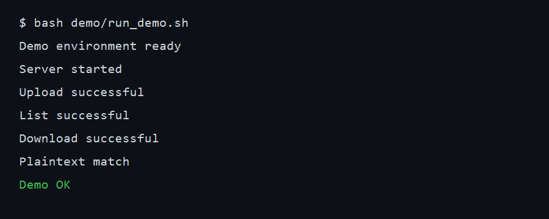

# Secure Zero-Trust File Drop System

Implementation for **CSE 4057 Programming Assignment, Spring 2026**
(due 24 May 2026).

A custom application-layer protocol over raw TCP that lets one user drop an
encrypted file at a server for another user. The server stores the
ciphertext and metadata only — it can never read plaintext file contents.
SSL/TLS libraries are deliberately not used; the handshake, key derivation,
and end-to-end encryption are implemented from scratch on top of the
`cryptography` library's primitives.

> See `ARCHITECTURE.md` for the system design (frozen at end of Phase 1)
> and `AI.md` for coding rules.

## Team Members

- Alp Büyükköse— Team Leader
- Kerem Hakkı Koç
- Turgut Köroğlu

## Project Status

| Milestone | Status |
|---|---|
| **M1 — Foundation (solo)** | ✅ Complete |
| M2 — Handshake + Upload (parallel) | ✅ Complete (this PR) |
| M3 — Download + Hardening + Bonus | ⚪ Not started |

### What M1 ships

- `ARCHITECTURE.md` — frozen system design, including the custom JSON
  certificate format (§3.2), the wire protocol (§7), the SQLite schema
  (§5), and the **frozen function signatures** that Phase 2/3 issues
  implement against (§10.1).
- `AI.md` — coding rules (zero-trust, fail-closed, constant-time
  comparison, no SSL libs).
- Working **CA module** with a CLI (`init`, `issue <username>`, `verify`).
- Working **TCP framing + envelope** in `zerotrust/common/protocol.py`.
- Working **crypto primitives** (RSA keygen with encrypted PEM, RSA-PSS
  sign/verify, RSA-OAEP wrap/unwrap, AES-256-GCM, HKDF-SHA256) in
  `zerotrust/common/crypto_primitives.py`.
- Working **replay nonce cache** (`zerotrust/server/replay.py`).
- Frozen `NotImplementedError` stubs for every Phase 2/3 entry point so
  parallel development is unblocked.
- 57 pytest tests covering happy path + negative path for every M1 module.

## Module Layout

```
zerotrust/
├── common/
│   ├── crypto_primitives.py    # RSA, AES-GCM, HKDF wrappers
│   ├── protocol.py             # length-prefixed JSON framing + envelope
│   ├── canonical.py            # canonical JSON for signing
│   ├── logger.py               # logger setup, fingerprint redaction
│   └── exceptions.py           # CryptoError / AuthError / ProtocolError
├── ca/
│   ├── cert.py                 # issue_certificate / verify_certificate
│   └── ca.py                   # CLI: init / issue / verify
├── server/
│   ├── replay.py               # ✅ implemented (check_and_record + purge)
│   ├── store.py                # 🟡 stub — Phase 2 issue #14
│   ├── handshake.py            # 🟡 stub — Phase 2 issue #8
│   ├── handler.py              # 🟡 stub — Phase 2 issue #5
│   └── main.py                 # 🟡 stub — Phase 2 issue #5
├── client/
│   ├── cli.py                  # 🟡 stub — Phase 2 issue #9
│   ├── handshake.py            # 🟡 stub — Phase 2 issue #8
│   ├── upload.py               # 🟡 stub — Phase 2 issue #12
│   └── download.py             # 🟡 stub — Phase 3 issue #17
└── tests/
    ├── test_protocol.py
    ├── test_crypto.py
    ├── test_canonical.py
    ├── test_ca.py
    └── test_replay.py
```

The `legacy/` directory contains the pre-architecture X.509 prototype, kept
for reference; nothing in the active package imports from it.

## How to Run

### 1. Setup

```bash
python -m venv venv
source venv/bin/activate         # Windows: venv\Scripts\activate
pip install -r requirements.txt
```

### 2. Run the test suite

```bash
pytest
```

All 57 tests should pass in under 2 seconds.

### 3. Bootstrap the CA and issue user certificates

```bash
# Initialise the CA (writes ca_data/{ca_private.pem, ca_public.pem, ca_cert.json})
python -m zerotrust.ca.ca init

# Issue certs for two demo users (writes users/<name>/{private.pem, public.pem, cert.json})
python -m zerotrust.ca.ca issue alice
python -m zerotrust.ca.ca issue bob

# Confirm a cert verifies against the CA trust anchor
python -m zerotrust.ca.ca verify users/alice/cert.json
```

### 4. Server / client (Phase 2)

The `zerotrust.server.main` and `zerotrust.client.cli` entry points raise
`NotImplementedError` until Phase 2 issues #5 and #9 land. The legacy
prototype (`legacy/server_x509.py`, `legacy/client_x509.py`) demonstrates a
working RSA-OAEP + HKDF handshake against X.509 certs and is a useful
reference, but it does **not** match the frozen architecture.

## Demo password handling

Per `AI.md` §3.10, all PEM-encoded private keys are protected with
`BestAvailableEncryption(password)`. For demo and testing, the CA CLI
accepts:

1. `--password <pw>` argument (highest priority)
2. `ZEROTRUST_CA_PASSWORD` environment variable
3. The hard-coded fallback `demo-password` (for grading convenience only)

This fallback is documented here, as required. Production deployments would
prompt interactively or use an OS keychain.

## Section 2 — Secure Handshake and Session Key Establishment

The assignment forbids using `ssl`, `pyOpenSSL`, or any pre-built secure-channel
library, so we hand-rolled the parts TLS would otherwise have done. Both sides
walk a five-step ladder (see `ARCHITECTURE.md` §7.4 for the full diagram):

```
HELLO ↔  →  KEY_EXCHANGE  →  AUTH_RESPONSE  →  SESSION_OK
```

`HELLO` exchanges each peer's CA-signed certificate and a fresh 16-byte nonce;
both sides verify the peer cert against the same trust anchor before reading
the embedded public key. The client then RSA-OAEP-encrypts a 32-byte
pre-master under the server's pubkey and sends `KEY_EXCHANGE`. From the two
nonces and the pre-master, both sides bind a transcript hash
`SHA-256(nonce_c ‖ nonce_s ‖ pre_master_ciphertext)`; the AUTH_RESPONSE and
SESSION_OK signatures cover that hash, so a man-in-the-middle who replays
fragments of an earlier handshake cannot reconstruct a valid signature.
**Both** sides sign the transcript (mutual PoP), so an attacker who steals one
private key can still not impersonate the other party. Finally HKDF-SHA256 is
seeded with `salt = nonce_c ‖ nonce_s`, `ikm = pre_master`, and the frozen
info string `b"zerotrust-v1"` to derive directional `c2s_key` and `s2c_key`.

We rejected a pure shared-symmetric-key design (no forward secrecy: a leaked
long-term key decrypts every past session) and a Diffie-Hellman ladder (an
extra primitive on top of the RSA stack already mandated for signatures and
cert verification). RSA-OAEP transport keeps the cryptographic surface to a
single algorithm family and matches the constraints in `ARCHITECTURE.md` §2.

Demo (after CA bootstrap from Section 1):

```bash
python -m zerotrust.server.main &
python -m zerotrust.client.cli --user alice login
# → Authenticated as alice; session established with zerotrust-server.
```

## Section 3 — Secure File Encryption and Upload

Every file is encrypted with a **fresh** AES-256-GCM key. We chose GCM over
CBC+HMAC because it is single-pass authenticated encryption — one primitive,
one nonce, one auth tag — which leaves fewer composition mistakes for a
reviewer to find. The key is 32 random bytes from `os.urandom`; the 12-byte
GCM nonce comes from the same source on every call, so the `(key, nonce)`
pair is unique by construction without any deterministic-nonce optimisation.

The AAD bound into the tag is `f"{file_id}|{sender}|{recipient}".encode()`
(see `ARCHITECTURE.md` §7.7). This stops the most natural attack on a
zero-trust drop server: without AAD, a curious server could paste Alice→Bob's
ciphertext into Carol→Dave's metadata row and the GCM decryption would still
succeed. With it, the auth tag depends on the routing context, so swapping
breaks the tag and the recipient sees a `CryptoError`.

The per-file AES key never leaves the client. We wrap it with RSA-OAEP-SHA256
under the **recipient's** CA-signed public key, fetched at upload time via
`GET_PUBKEY` and re-verified locally against the CA trust anchor. The server
stores only the ciphertext on disk and a metadata row with the wrapped key,
nonce, AAD, hashes and origin signature — schema in `ARCHITECTURE.md` §5.
Ciphertext lives in `server/storage/files/<file_id>.bin`; writes are done
through a `*.bin.tmp` + `os.replace` so a crash mid-upload leaves no
half-files.

Demo:

```bash
python -m zerotrust.client.cli --user alice upload bob ./report.pdf
# → Uploaded file_id=<uuid> to bob; expires=<unix>
```

## Section 4 — Digital Signature and Integrity Verification

Every upload carries an RSA-PSS signature over the canonical JSON of the
seven-field origin struct from `ARCHITECTURE.md` §7.6: `sender`,
`recipient`, `file_id`, `ciphertext_sha256`, `wrapped_key_sha256`,
`timestamp`, `expiration`. The signer hashes the bytes produced by
`canonical_json` (`sort_keys=True, separators=(",", ":")`); any whitespace
drift invalidates the signature, so canonical serialisation is the single
source of truth.

The key trick is binding **both** `ciphertext_sha256` AND `wrapped_key_sha256`
in the same struct. Binding only the ciphertext would let a malicious server
splice in a wrapped key under an attacker's pubkey; binding only the wrapped
key would let it substitute a different ciphertext. Binding both forces the
server to relay exactly what the sender signed — or surface as `AUTH_FAILED`.

We chose RSA-PSS over PKCS#1 v1.5 because PSS has the cleaner provable
security argument and the implementation cost is identical. Staying RSA-only
across signatures, OAEP, and the handshake keeps the asymmetric stack to a
single algorithm family.

Verification runs twice. The server re-runs `verify_origin_struct` on every
`UPLOAD_REQUEST`, so tampered or replayed packages never reach the DB. On
`DOWNLOAD_RESPONSE` the recipient re-verifies (#18 / M3) — server-side
success is not authority.

Demo:

```bash
pytest zerotrust/tests/test_server_upload.py -k tampered
# → tampered ciphertext → AUTH_FAILED, no disk write, no row
```

## Section 5 — Reproducible Demo

The grading demo is scripted in `demo/run_demo.sh`, so a fresh clone can prove
the end-to-end flow without manual setup:

```bash
make install
bash demo/run_demo.sh
```

The script cleans generated state, installs runtime requirements, bootstraps
the CA, issues `server`, `alice`, and `bob`, starts the server in the
background, runs Alice's upload, runs Bob's list and download, and asserts the
downloaded plaintext matches `demo/sample_files/report.txt`. It also diffs its
stable transcript against `demo/expected_output.txt`; dynamic UUIDs and
expiration timestamps are checked internally rather than printed.

Captured successful run:



The same run is also stored as `demo/demo.cast` for offline terminal playback.

## Frozen Cryptographic Choices

| Purpose | Algorithm |
|---|---|
| Asymmetric (signatures, key wrap, session establishment) | RSA-2048 |
| Signature padding | RSA-PSS (SHA-256, MGF1, salt = digest length) |
| Key wrapping & session key transport | RSA-OAEP (SHA-256, MGF1) |
| Symmetric encryption | AES-256-GCM |
| Key derivation | HKDF-SHA256 |
| Hash | SHA-256 |
| Random source | `os.urandom()` / `secrets` only |

Any change requires updating `ARCHITECTURE.md` §2 and notifying the team.

## Security Analysis

To be written in Phase 3 (issue #22b). The known limitations enumerated in
`ARCHITECTURE.md` §12 will be discussed there.
